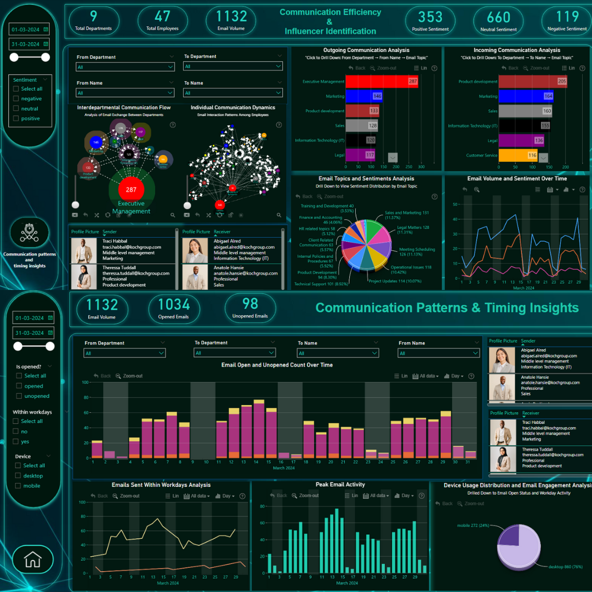

# Onyx Data July 2024 Challenge Submission

## Challenge Overview
**Dates:** Jul 01 - Jul 30, 2024 | IST

The Onyx Data July 2024 Challenge focuses on decoding corporate conversations by analyzing internal email communication dynamics to uncover insights and trends. This challenge provides an opportunity to enhance organizational efficiency and optimize communication patterns.

## Project Objectives
- **Optimized Communication:** Uncover common topics and sentiments to enhance message clarity and relevance.
- **Identifying Key Players:** Identify internal influencers who drive communication and collaboration within the team or organization.
- **Spotting Communication Gaps:** Identify bottlenecks and gaps to ensure smooth information flow.
- **Structuring Communication:** Gain insights into communication structures to improve organizational coherence.
- **Timing and Activity Insights:** Determine peak periods for optimal scheduling and timely responses.

## Tools and Techniques Used
- **Power BI:** Utilized for data visualization and dashboard creation.
- **ZoomCharts Visuals:** Employed to create interactive, responsive charts for deeper insights.
- **DAX Formulas:** Used for precise calculations and dynamic filtering.

## Key Insights and Analysis
### Optimized Communication
- **KPI Cards:**
  - Number of Emails
  - Positive Sentiment Emails
  - Negative Sentiment Emails
- **Analysis:**
  - ZoomCharts Advanced Pie Chart for sentiment distribution.
  - ZoomCharts Time Series Chart for trends over time.
- **Slicers:**
  - Date
  - Department
  - Topic

### Identifying Key Players
- **KPI Cards:**
  - Number of Emails Sent
  - Number of Emails Received
- **Analysis:**
  - ZoomCharts Drill Down Network Chart for communication flow.
- **Slicers:**
  - Date
  - Department
  - Seniority

### Spotting Communication Gaps
- **KPI Cards:**
  - Average Response Time
- **Analysis:**
  - ZoomCharts Network Graph for identifying communication gaps.
- **Slicers:**
  - Date
  - Department
  - Seniority

### Structuring Communication
- **KPI Cards:**
  - Number of Emails by Topic
- **Analysis:**
  - ZoomCharts Pie Chart for topic distribution.
- **Slicers:**
  - Date
  - Department
  - Topic

### Timing and Activity Insights
- **KPI Cards:**
  - Emails Sent During Work Hours
  - Emails Sent Outside Work Hours
- **Analysis:**
  - ZoomCharts Line Chart for timing analysis.
  - ZoomCharts Advanced Pie Chart for device usage distribution.
- **Slicers:**
  - Date
  - Device
  - Work Hours

## Dashboard Access
[Dashboard Link](internal email communication dynamics.pbix)

## Screenshot

## Conclusion
Participating in the Onyx Data July 2024 Challenge has been a rewarding experience, providing an opportunity to enhance my data analysis skills and learn to use ZoomCharts visuals effectively. This project has enabled me to gain valuable insights into corporate communication dynamics and contribute to organizational efficiency.

## Acknowledgments
- Thanks to Onyx Data for organizing this challenge.
- Gratitude to the community and resources that supported me through this learning journey.

## Contact
For any questions or further information, please contact me at [https://www.linkedin.com/in/sanchitapatil/].

---

